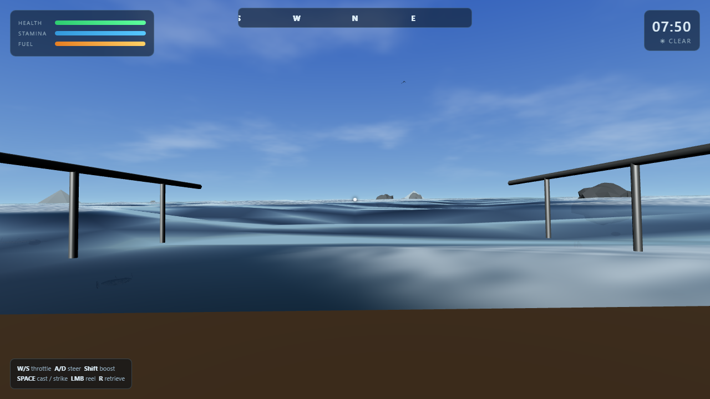
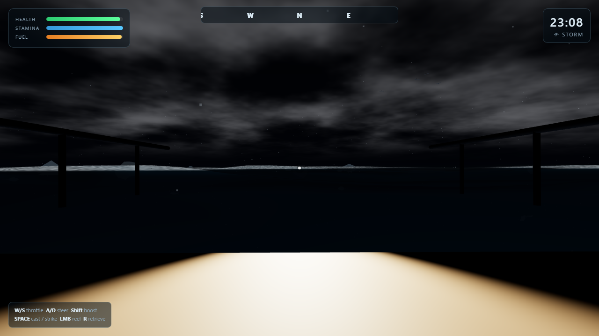
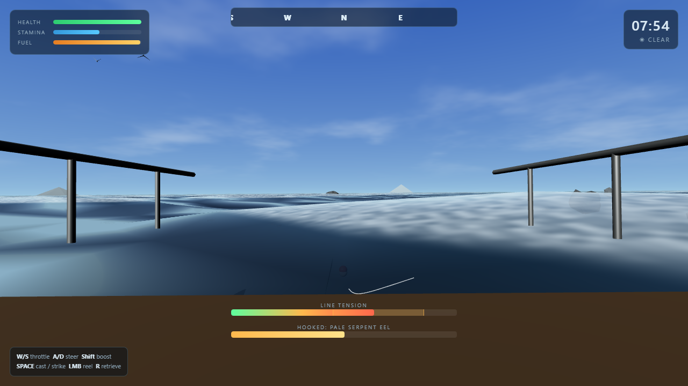
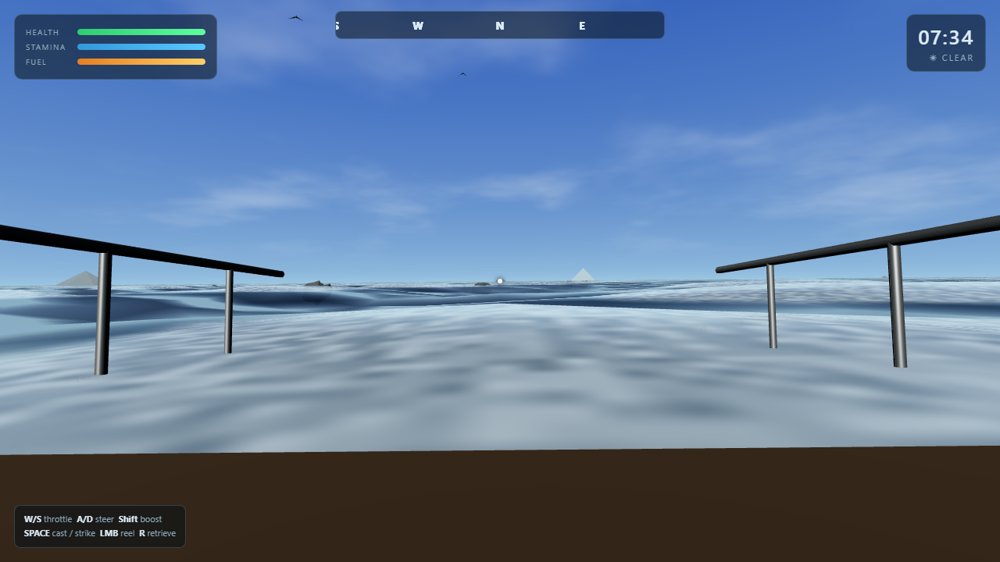

# ABYSSAL DRIFT

First-person deep-water monster fishing survival game.
You have one boat, one rod, and hostile waters full of colossal fish.
Cast, fight, survive — day turns to night, storms roll in, and the line
can snap.

Built with **Three.js (WebGL)** as a fully playable prototype. Core systems
are deliberately decoupled (config tables, pure-function math, discrete
systems) so the gameplay logic ports to **Unreal Engine 5** with minimal
rewiring — see [Porting to Unreal](#porting-to-unreal) below.

## ▶ Play it live

**<https://mikkop88.github.io/abyssal-drift/>** — hosted on GitHub Pages,
no install, no build. Click *SET OUT TO SEA*, then grab the mouse.

| Day | Night storm | Fight | Fish |
|-----|-------------|-------|------|
|  |  |  |  |

---

## Run it

Requires a modern browser with WebGL. Serve the folder over HTTP
(module scripts don't load from `file://`):

```bash
node tools/server.mjs 8000
# then open http://localhost:8000
```

Any static server works (`npx serve`, VS Code Live Server, Python's
`http.server`, …). No build step, no dependencies to install — Three.js is
vendored in `libs/`.

### Controls

| Key | Action |
|-----|--------|
| `W` / `S` | Throttle forward / reverse |
| `A` / `D` | Steer |
| `Shift` | Boost |
| Mouse | Look |
| Hold `Space` | Charge cast, release to throw |
| `Space` | Strike when the bobber dives |
| Hold `LMB` | Reel during the fight |
| `R` | Retrieve line |

**The fight:** keep line tension in the amber sweet-spot to fill the catch
meter. Too loose and the fish regains ground; too tight (red) and the line
snaps. Aggressive species surge in bursts — ease off, then grind.

---

## Architecture

```
index.html          Page shell (canvas + UI layer)
main.js             Entry point — boots Game
styles.css          HUD styling
libs/three.module.js  Vendored Three.js r160 (offline, no CDN)
game/
  config.js         ALL tunables: world, boat, fishing, fish species, audio
  utils.js          Pure math/RNG/noise (clamp, lerp, fbm, angleLerp…)
  input.js          Keyboard + mouse + pointer-lock
  audio.js          100% procedural WebAudio (ocean, wind, engine, reel, SFX)
  ocean.js          Custom GLSL ocean: summed directional waves, fresnel,
                    sun glints, crest foam, exp² fog. CPU mirror of the same
                    wave field so boat/fish ride the exact rendered surface.
  sky.js            Shader skydome (day/night, sun, moon, stars, clouds) +
                    owns sun/hemi/ambient lights + scene fog
  boat.js           Procedural hull (lofted geometry), physics, wave-follow
                    tilt, first-person camera rig
  fish.js           Procedural monsters (lofted spines, fins, teeth, glowing
                    eyes; ray + cephalopod specials), swim animation, AI,
                    population manager with respawning
  fishing.js        Rod/line/bobber + state machine:
                    IDLE→CASTING→WAITING→BITE→FIGHT→CAUGHT/BROKEN/ESCAPED
  environment.js    Rocks, island silhouettes, gulls, storm rain
  hud.js            DOM overlay: vitals, compass, clock, fishing meters,
                    alerts, toasts, start/death screens
  game.js           Orchestrator: renderer, frame loop, survival state,
                    weather, stats
tools/
  server.mjs        Zero-dependency static server
  smoke_test.html   Headless boot + render diagnostics
  validation.html   Production validation harness (47 assertions)
  shots.html        Deterministic scenario driver for screenshots
```

### Frame order (game.js)

`time/weather → player survival → boat input+physics → look →
sky → ocean → fish → fishing → environment → camera → audio → HUD → render`

Each system is a class with a single `update(dt, …)` and no hidden globals —
the seam for the Unreal port.

---

## Porting to Unreal

The prototype was structured so each JS system maps to a UE counterpart:

| Prototype | Unreal target |
|-----------|---------------|
| `config.js` | `UDataAsset` / `UDeveloperSettings` structs (near 1:1) |
| `utils.js` | Static C++ math (already pure functions) |
| `ocean.js` wave field | Water shader (UE5 Water plugin / custom Material with the same summed-wave vertex displacement) |
| `sky.js` | PostProcess sky + `ATimeOfDayController` driving `DirectionalLight` |
| `boat.js` physics | `UPhysicsAsset` hull + `UCharacterMovementComponent`-style controller |
| `fish.js` | Skeletal meshes (retopo the procedural spines), `AnimInstance` swim curves, AI via the same species-data table feeding a `UDataTable` |
| `fishing.js` state machine | `UEnum`-driven `UStateMachine` / GameplayAbility for the fight |
| `hud.js` | UMG widgets (same layout) |
| `audio.js` | MetaSounds (procedural layers → granular/parametric sounds) |

The species table in `config.js` is intentionally data-shaped (id, length,
girth, palette, speed, aggression, weight range, depth band) — drop it into a
`UDataTable` and the same records drive both engines.

### Closing the photorealism gap (roadmap)

The prototype is stylized-realtime. To reach the Alan Wake 2 / GTA IV bar in
Unreal: Nanite-scanned hull + fish assets, Quixel Megascans water/rocks,
Lumen GI, virtual shadow maps, Niagara spray/foam/volumetrics, motion-captured
swim cycles, and a full post stack (film grain, bloom, depth-aware fog). The
gameplay skeleton above is what you'd keep.

---

## Verified

Production validation runs headlessly (Chromium + SwiftShader WebGL) via
`tools/validation.html`, which drives the real `Game` frame-by-frame with
`tickOnce()` and asserts 47 checks across four sections. Last run —
**47/47 PASS**, executed against both `localhost` and the live GitHub Pages
URL:

```
A. STRUCTURE / GEOMETRY (17)
   A1  renderer live: 54+ draw calls, ~24k tris/frame, ≥5 shader programs,
       72 scene nodes
   A2  geometry sweep: 202 meshes, ~35,642 tris total, 0 NaN vertices,
       0 empty geometries
   A3  boat hull bounding box = 9.00 m; forward vector unit-length
   A4  all 5 species instantiate with valid multi-part geometry
       (gulper 23 parts, serpent 17, leviathan-ray 4, kraken 11, aurora 8)
   A5  ocean CPU/GPU wave mirror: field variance σ=0.31, normals unit-length

B. GRAPHICS — pixel probes via readPixels (8)
   B1  day: sky blue+bright [81,124,197], sea cool water hue, deck wood-toned,
       no black frame
   B2  sea animates (wave field visibly advancing)
   B3  night: sky dark [5,6,9], sea dims, headlight warms deck [197,180,152]

C. GAMEPLAY (20)
   C1-C5  full chain: idle → charged cast → waiting → forced bite → strike
           → controlled fight → CAUGHT in 13.7 s (stats + respawn queued)
   C6     line snaps at max tension (BROKEN)
   C7     fish escapes on slack line (ESCAPED)
   C8     throttle → 10.5 m/s, steering turns, fuel burns
   C9     clock advances; storm drains health
   C10    pause freezes the simulation
   C11    death detected + death screen shown

D. PERFORMANCE (1)
   D1     sustained frame cost well under budget on SwiftShader
```

Visual proof matrix (captured from the same deterministic drivers):
`media/day.png`, `media/night.png`, `media/fight.png`, `media/fish.png`.

Reproduce locally:

```bash
node tools/server.mjs 8000
# open http://localhost:8000/tools/validation.html?preserve in a browser, or:
chrome --headless=new --use-gl=swiftshader --virtual-time-budget=30000 \
  --dump-dom "http://localhost:8000/tools/validation.html?preserve"
```
